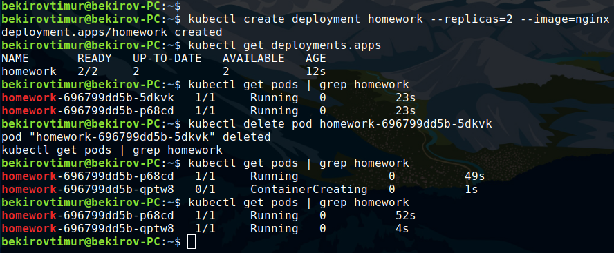

### Homework
* Create a deployment nginx. Set up two replicas. Remove one of the pods, see what happens.

```bash
bekirovtimur@bekirov-PC:~$ kubectl create deployment homework --replicas=2 --image=nginx
deployment.apps/homework created

bekirovtimur@bekirov-PC:~$ kubectl get deployments.apps
NAME       READY   UP-TO-DATE   AVAILABLE   AGE
homework   2/2     2            2           12s

bekirovtimur@bekirov-PC:~$ kubectl get pods | grep homework
homework-696799dd5b-5dkvk   1/1     Running   0          23s
homework-696799dd5b-p68cd   1/1     Running   0          23s

bekirovtimur@bekirov-PC:~$ kubectl delete pod homework-696799dd5b-5dkvk
pod "homework-696799dd5b-5dkvk" deleted

bekirovtimur@bekirov-PC:~$ kubectl get pods | grep homework
homework-696799dd5b-p68cd   1/1     Running             0          49s
homework-696799dd5b-qptw8   0/1     ContainerCreating   0          1s

bekirovtimur@bekirov-PC:~$ kubectl get pods | grep homework
homework-696799dd5b-p68cd   1/1     Running   0          52s
homework-696799dd5b-qptw8   1/1     Running   0          4s
```


