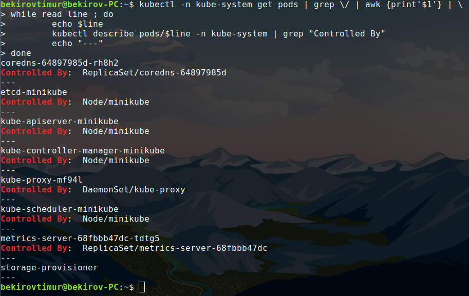
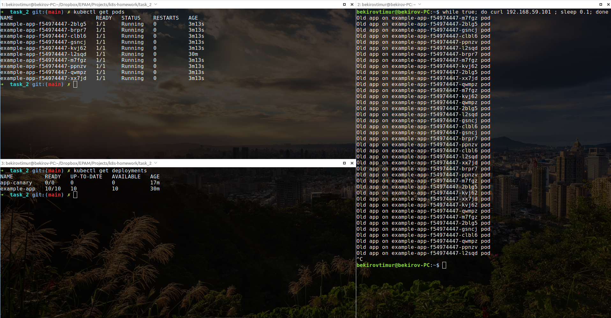
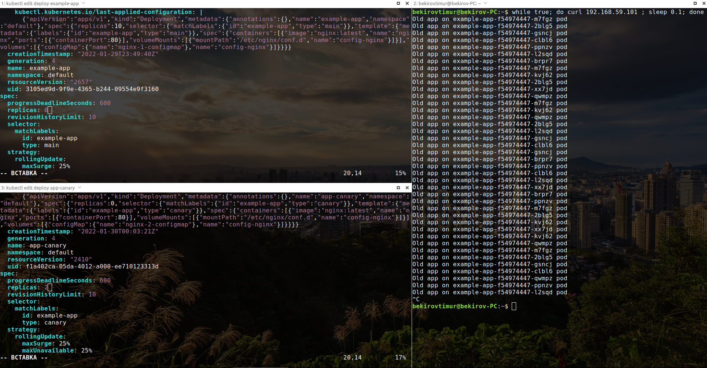
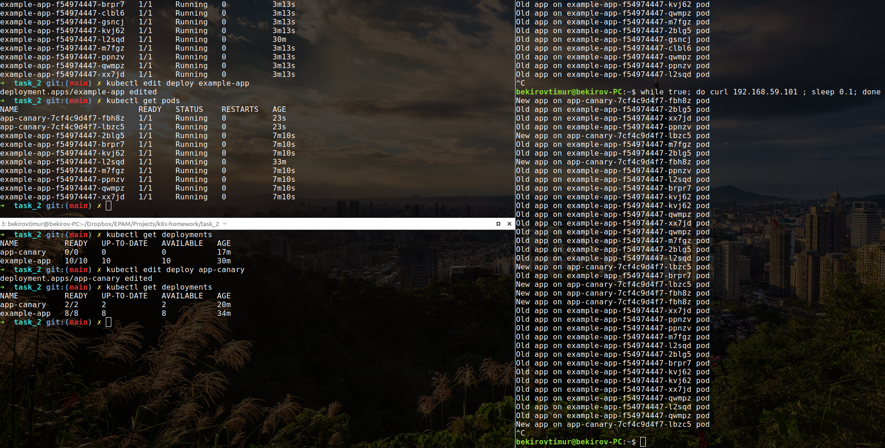
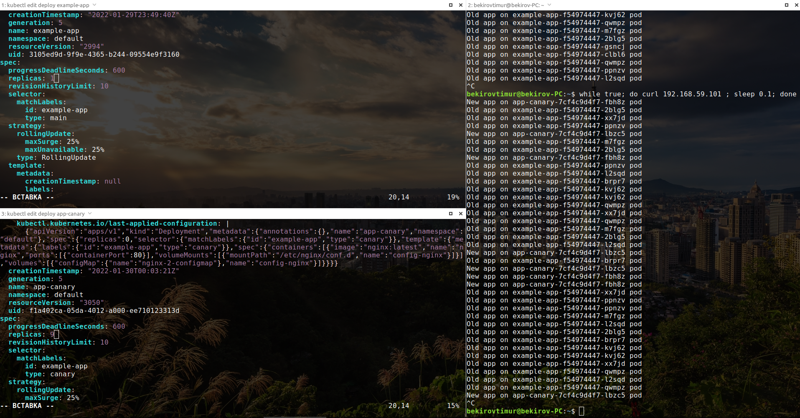
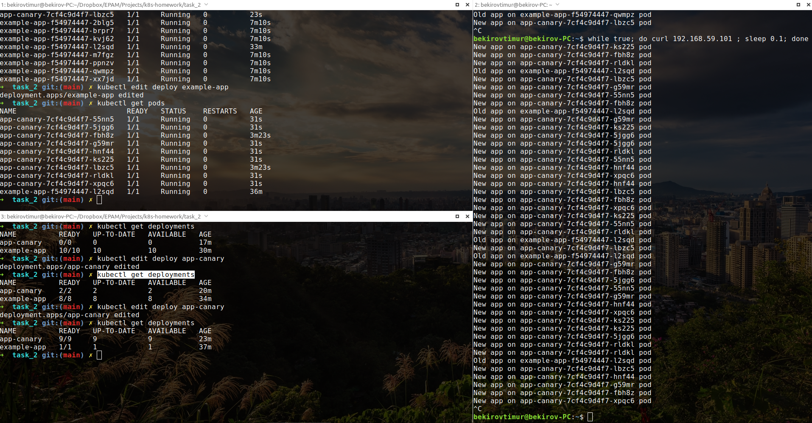

### Homework
* In Minikube in namespace kube-system, there are many different pods running. Your task is to figure out who creates them, and who makes sure they are running (restores them after deletion).

* Implement Canary deployment of an application via Ingress. Traffic to canary deployment should be redirected if you add "canary:always" in the header, otherwise it should go to regular deployment.
Set to redirect a percentage of traffic to canary deployment.

On first screenshot "Old" application works on 10 pods named example-app-*:

Addind two replicas of "New" application:

As we can see, 20% of answers comes from "New" application, from two app-canary-* nodes:

Let's try reduce replica number of "Old" application, and increase replicas of "New" application:

And finally we seeing, that answers from "New" version of application has been reached to 90%:

Works like a charm! =)
