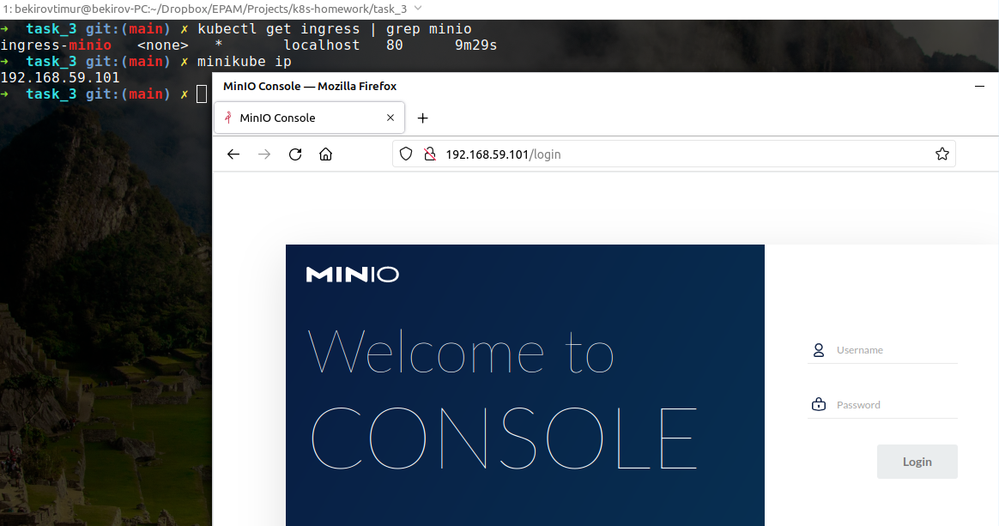
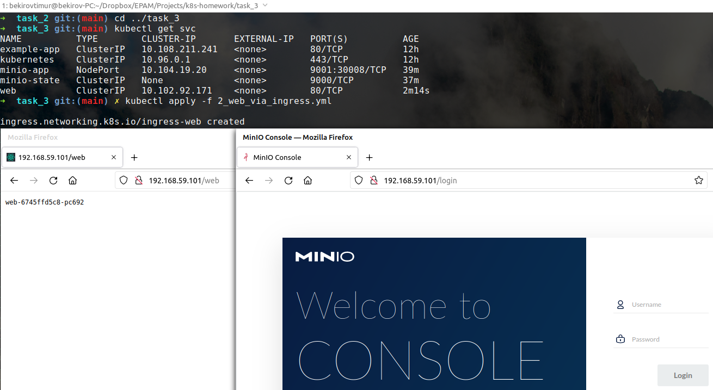

### Homework
* We published minio "outside" using nodePort. Do the same but using ingress.
```bash
➜  task_3 git:(main) ✗ kubectl get service | grep minio-app
minio-app     NodePort    10.104.19.20     <none>        9001:30008/TCP   15m
```

```bash
➜  task_3 git:(main) ✗ cat 1_minio_via_ingress.yml                 
apiVersion: networking.k8s.io/v1
kind: Ingress
metadata:
  name: ingress-minio
  annotations:
    kubernetes.io/ingress.class: "nginx"
spec:
  rules:
  - http:
      paths:
      - path: /
        pathType: Prefix
        backend:
          service:
             name: minio-app
             port:
                number: 9001
```

```bash
➜  task_3 git:(main) ✗ kubectl apply -f 1_minio_via_ingress.yml
ingress.networking.k8s.io/ingress-minio created
```

```bash
➜  task_3 git:(main) ✗ kubectl get ingress | grep minio
ingress-minio   <none>   *       localhost   80      2m25s
```

```bash
➜  task_3 git:(main) ✗ minikube ip
192.168.59.101
```


* Publish minio via ingress so that minio by ip_minikube and nginx returning hostname (previous job) by path ip_minikube/web are available at the same time.
```bash
➜  task_3 git:(main) cd ../task_2
```

```bash
➜  task_2 git:(main) kubectl apply -f nginx-configmap.yaml
configmap/nginx-configmap created
```

```bash
➜  task_2 git:(main) kubectl apply -f deployment.yaml
deployment.apps/web created
```

```bash
➜  task_2 git:(main) kubectl apply -f service_template.yaml
service/web created
```

```bash
➜  task_2 git:(main) kubectl get svc
NAME          TYPE        CLUSTER-IP       EXTERNAL-IP   PORT(S)          AGE
example-app   ClusterIP   10.108.211.241   <none>        80/TCP           12h
kubernetes    ClusterIP   10.96.0.1        <none>        443/TCP          12h
minio-app     NodePort    10.104.19.20     <none>        9001:30008/TCP   37m
minio-state   ClusterIP   None             <none>        9000/TCP         35m
web           ClusterIP   10.102.92.171    <none>        80/TCP           8s
```

```bash
➜  task_2 git:(main) cd ../task_3
```

```bash
➜  task_3 git:(main) ✗ cat 2_web_via_ingress.yml
apiVersion: networking.k8s.io/v1
kind: Ingress
metadata:
  name: ingress-web
  annotations:
    kubernetes.io/ingress.class: "nginx"
spec:
  rules:
  - http:
      paths:
      - path: /web
        pathType: Prefix
        backend:
          service:
             name: web
             port:
                number: 80
```

```bash
➜  task_3 git:(main) ✗ kubectl apply -f 2_web_via_ingress.yml
ingress.networking.k8s.io/ingress-web created
```


* Create deploy with emptyDir save data to mountPoint emptyDir, delete pods, check data.
* Optional. Raise an nfs share on a remote machine. Create a pv using this share, create a pvc for it, create a deployment. Save data to the share, delete the deployment, delete the pv/pvc, check that the data is safe.
