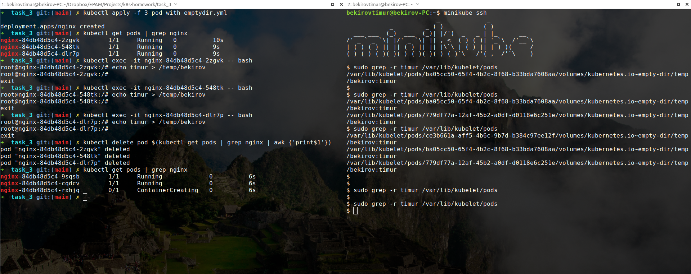

### Homework
* We published minio "outside" using nodePort. Do the same but using ingress.
```bash
➜  task_3 git:(main) ✗ kubectl get service | grep minio-app
minio-app     NodePort    10.104.19.20     <none>        9001:30008/TCP   15m
```

```bash
➜  task_3 git:(main) ✗ cat 1_minio_via_ingress.yml                 
apiVersion: networking.k8s.io/v1
kind: Ingress
metadata:
  name: ingress-minio
  annotations:
    kubernetes.io/ingress.class: "nginx"
spec:
  rules:
  - http:
      paths:
      - path: /
        pathType: Prefix
        backend:
          service:
             name: minio-app
             port:
                number: 9001
```

```bash
➜  task_3 git:(main) ✗ kubectl apply -f 1_minio_via_ingress.yml
ingress.networking.k8s.io/ingress-minio created
```

```bash
➜  task_3 git:(main) ✗ kubectl get ingress | grep minio
ingress-minio   <none>   *       localhost   80      2m25s
```

```bash
➜  task_3 git:(main) ✗ minikube ip
192.168.59.101
```


* Publish minio via ingress so that minio by ip_minikube and nginx returning hostname (previous job) by path ip_minikube/web are available at the same time.
```bash
➜  task_3 git:(main) cd ../task_2
```

```bash
➜  task_2 git:(main) kubectl apply -f nginx-configmap.yaml
configmap/nginx-configmap created
```

```bash
➜  task_2 git:(main) kubectl apply -f deployment.yaml
deployment.apps/web created
```

```bash
➜  task_2 git:(main) kubectl apply -f service_template.yaml
service/web created
```

```bash
➜  task_3 git:(main) ✗ kubectl get svc | grep web            
web           ClusterIP   10.102.92.171    <none>        80/TCP           11m
```

```bash
➜  task_2 git:(main) cd ../task_3
```

```bash
➜  task_3 git:(main) ✗ cat 2_web_via_ingress.yml
apiVersion: networking.k8s.io/v1
kind: Ingress
metadata:
  name: ingress-web
  annotations:
    kubernetes.io/ingress.class: "nginx"
spec:
  rules:
  - http:
      paths:
      - path: /web
        pathType: Prefix
        backend:
          service:
             name: web
             port:
                number: 80
```

```bash
➜  task_3 git:(main) ✗ kubectl apply -f 2_web_via_ingress.yml
ingress.networking.k8s.io/ingress-web created
```


* Create deploy with emptyDir save data to mountPoint emptyDir, delete pods, check data.

Applying deploy with three pods
```bash
➜  task_3 git:(main) ✗ kubectl apply -f 3_pod_with_emptydir.yml       
deployment.apps/nginx created
```

Getting pods
```bash
➜  task_3 git:(main) ✗ kubectl get pods | grep nginx           
nginx-84db48d5c4-2zgvk        1/1     Running   0          10s
nginx-84db48d5c4-548tk        1/1     Running   0          9s
nginx-84db48d5c4-dlr7p        1/1     Running   0          9s
```

Creating "bekirov" named file, contains string "timur" on each pod
```bash
➜  task_3 git:(main) ✗ kubectl exec -it nginx-84db48d5c4-2zgvk -- bash
root@nginx-84db48d5c4-2zgvk:/# echo timur > /temp/bekirov
root@nginx-84db48d5c4-2zgvk:/# exit
```
```bash
➜  task_3 git:(main) ✗ kubectl exec -it nginx-84db48d5c4-548tk -- bash
root@nginx-84db48d5c4-548tk:/# echo timur > /temp/bekirov
root@nginx-84db48d5c4-548tk:/# exit
```
```bash
➜  task_3 git:(main) ✗ kubectl exec -it nginx-84db48d5c4-dlr7p -- bash
root@nginx-84db48d5c4-dlr7p:/# echo timur > /temp/bekirov
root@nginx-84db48d5c4-dlr7p:/# exit
```

Let's enter to Minikube node and check our data:
```bash
~$ minikube ssh

$ sudo grep -r timur /var/lib/kubelet/pods
/var/lib/kubelet/pods/ce3b661a-aff5-4b6c-9b7d-b384c97ee12f/volumes/kubernetes.io~empty-dir/temp/bekirov:timur
/var/lib/kubelet/pods/ba05cc50-65f4-4b2c-8f68-b33bda7608aa/volumes/kubernetes.io~empty-dir/temp/bekirov:timur
/var/lib/kubelet/pods/779df77a-12af-45b2-a0df-d0118e6c251e/volumes/kubernetes.io~empty-dir/temp/bekirov:timur
```
All three files are present.

Ok, let's delete pods:
```bash
➜  task_3 git:(main) ✗ kubectl delete pod $(kubectl get pods | grep nginx | awk {'print$1'})
pod "nginx-84db48d5c4-2zgvk" deleted
pod "nginx-84db48d5c4-548tk" deleted
pod "nginx-84db48d5c4-dlr7p" deleted
```

```bash
➜  task_3 git:(main) ✗ kubectl get pods | grep nginx                                        
nginx-84db48d5c4-9sqsb        1/1     Running             0          6s
nginx-84db48d5c4-cqdcv        1/1     Running             0          6s
nginx-84db48d5c4-rxhjq        1/1     Running             0          6s
```

And re-check data on Minikube node:
```bash
~$ minikube ssh

$ sudo grep -r timur /var/lib/kubelet/pods
$
$ sudo grep -r timur /var/lib/kubelet/pods
$
```
All data is gone.

```bash
__________
< Awesome! >
----------
       \   ^__^
        \  (oo)\_______
           (__)\       )\/\
               ||----w |
               ||     ||

```


* Optional. Raise an nfs share on a remote machine. Create a pv using this share, create a pvc for it, create a deployment. Save data to the share, delete the deployment, delete the pv/pvc, check that the data is safe.
```bash
¯\_(ツ)_/¯
```
