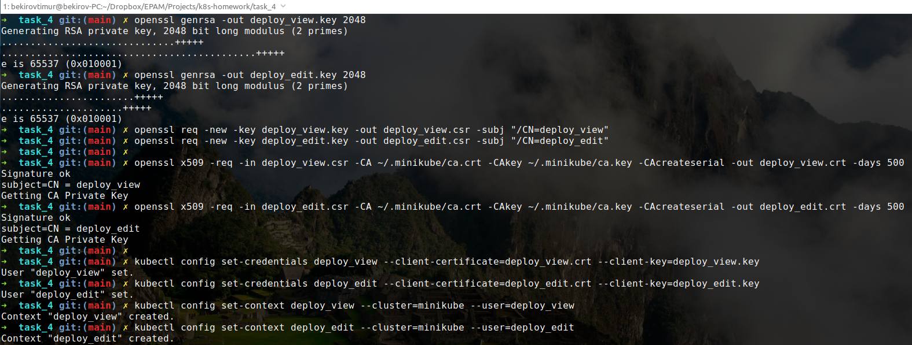
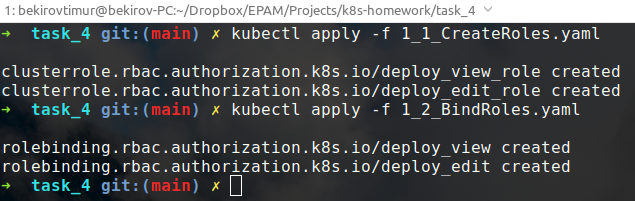
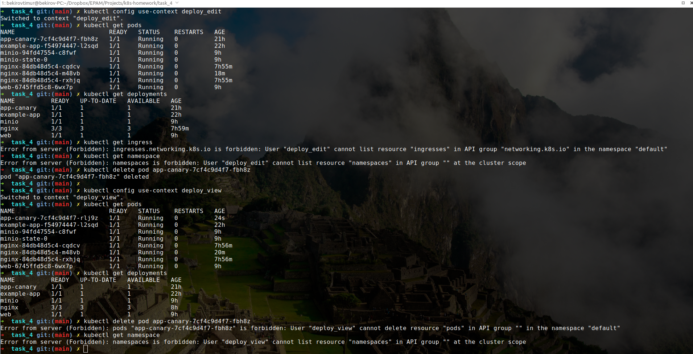
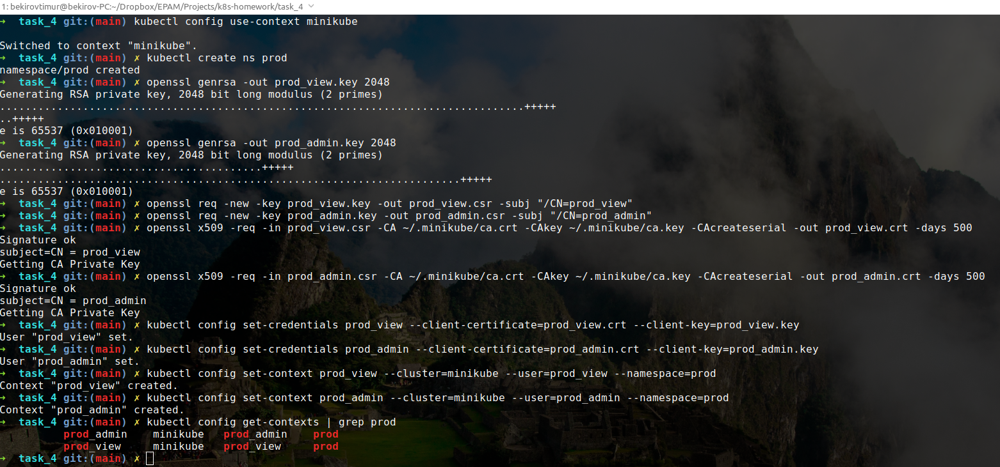
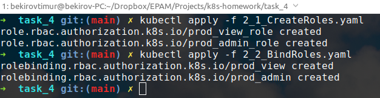
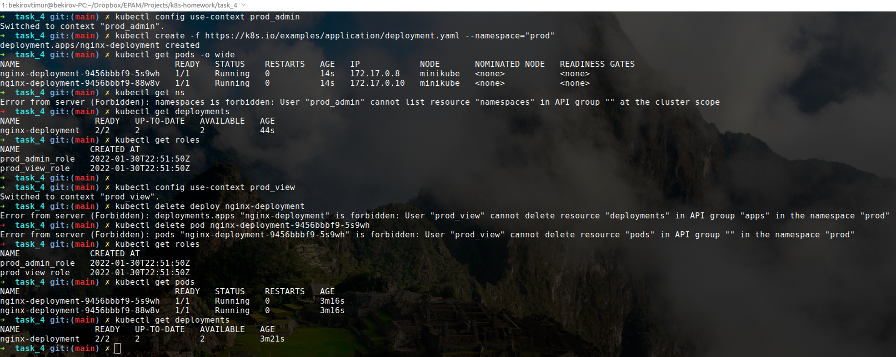
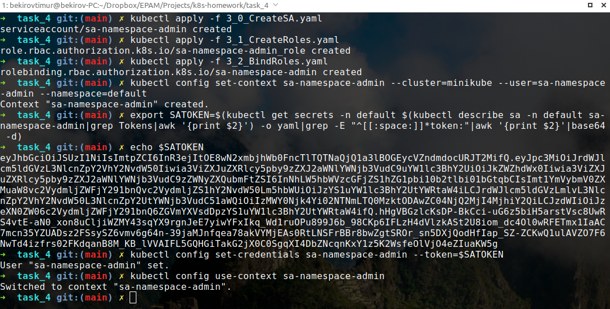
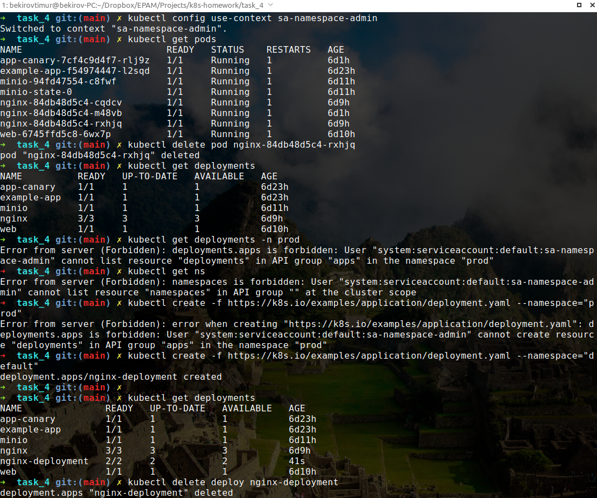

### Homework
* Create users deploy_view and deploy_edit. Give the user deploy_view rights only to view deployments, pods. Give the user deploy_edit full rights to the objects deployments, pods.

```bash
openssl genrsa -out deploy_view.key 2048
openssl genrsa -out deploy_edit.key 2048

openssl req -new -key deploy_view.key -out deploy_view.csr -subj "/CN=deploy_view"
openssl req -new -key deploy_edit.key -out deploy_edit.csr -subj "/CN=deploy_edit"

openssl x509 -req -in deploy_view.csr -CA ~/.minikube/ca.crt -CAkey ~/.minikube/ca.key -CAcreateserial -out deploy_view.crt -days 500
openssl x509 -req -in deploy_edit.csr -CA ~/.minikube/ca.crt -CAkey ~/.minikube/ca.key -CAcreateserial -out deploy_edit.crt -days 500

kubectl config set-credentials deploy_view --client-certificate=deploy_view.crt --client-key=deploy_view.key
kubectl config set-credentials deploy_edit --client-certificate=deploy_edit.crt --client-key=deploy_edit.key

kubectl config set-context deploy_view --cluster=minikube --user=deploy_view
kubectl config set-context deploy_edit --cluster=minikube --user=deploy_edit
```


```bash
kubectl apply -f 1_1_CreateRoles.yaml
kubectl apply -f 1_2_BindRoles.yaml
```


Okay, now let's check it out:



* Create namespace prod. Create users prod_admin, prod_view. Give the user prod_admin admin rights on ns prod, give the user prod_view only view rights on namespace prod.

```bash
kubectl config use-context minikube

kubectl create ns prod

openssl genrsa -out prod_view.key 2048
openssl genrsa -out prod_admin.key 2048

openssl req -new -key prod_view.key -out prod_view.csr -subj "/CN=prod_view"
openssl req -new -key prod_admin.key -out prod_admin.csr -subj "/CN=prod_admin"

openssl x509 -req -in prod_view.csr -CA ~/.minikube/ca.crt -CAkey ~/.minikube/ca.key -CAcreateserial -out prod_view.crt -days 500
openssl x509 -req -in prod_admin.csr -CA ~/.minikube/ca.crt -CAkey ~/.minikube/ca.key -CAcreateserial -out prod_admin.crt -days 500

kubectl config set-credentials prod_view --client-certificate=prod_view.crt --client-key=prod_view.key
kubectl config set-credentials prod_admin --client-certificate=prod_admin.crt --client-key=prod_admin.key

kubectl config set-context prod_view --cluster=minikube --user=prod_view --namespace=prod
kubectl config set-context prod_admin --cluster=minikube --user=prod_admin --namespace=prod
```


```bash
kubectl apply -f 2_1_CreateRoles.yaml
kubectl apply -f 2_2_BindRoles.yaml
```


Okay, let's check the result:



* Create a serviceAccount sa-namespace-admin. Grant full rights to namespace default. Create context, authorize using the created sa, check accesses.


```bash
kubectl config use-context minikube
```

Create a serviceAccount sa-namespace-admin
```bash
kubectl apply -f 3_0_CreateSA.yaml
```

Grant full rights to namespace default
```bash
kubectl apply -f 3_1_CreateRoles.yaml
kubectl apply -f 3_2_BindRoles.yaml
```

Create context
```bash
kubectl config set-context sa-namespace-admin --cluster=minikube --user=sa-namespace-admin --namespace=default
```

Authorize using the created sa
```bash
export SATOKEN=$(kubectl get secrets -n default $(kubectl describe sa -n default sa-namespace-admin|grep Tokens|awk '{print $2}') -o yaml|grep -E "^[[:space:]]*token:"|awk '{print $2}'|base64 -d)

kubectl config set-credentials sa-namespace-admin --token=$SATOKEN

kubectl config use-context sa-namespace-admin
```


Check accesses

